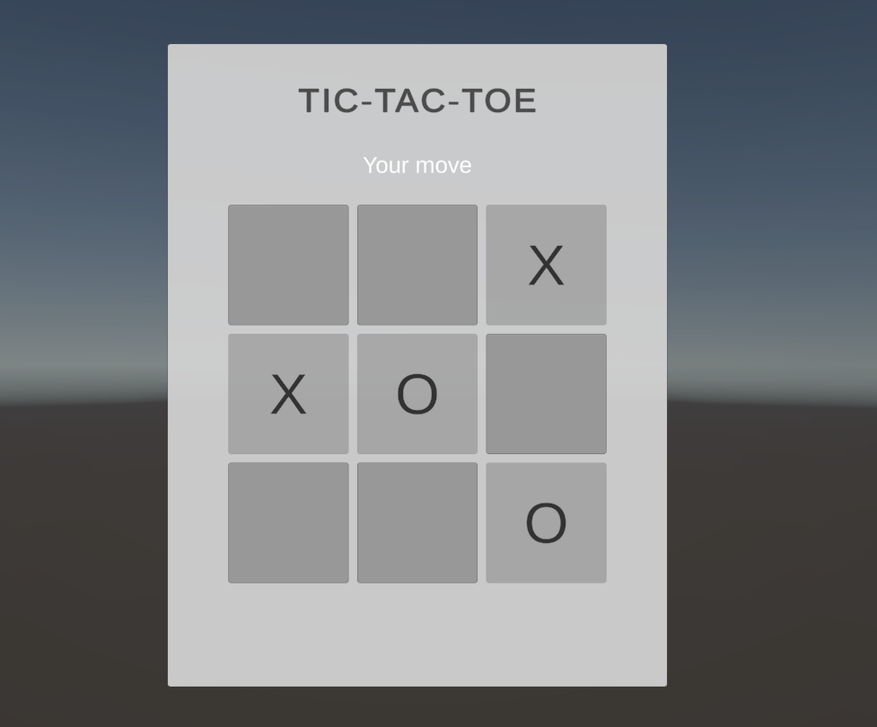
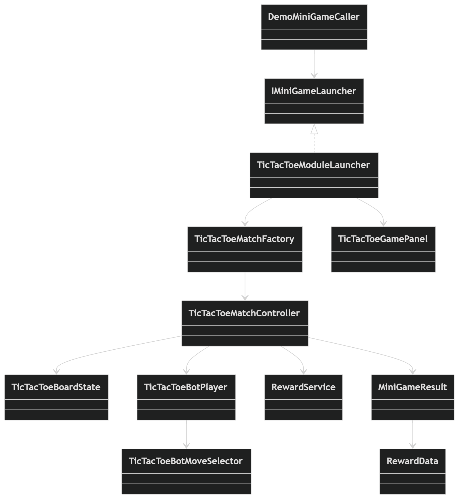

# Tic-Tac-Toe MiniGame Module

## Demo Video

[](https://disk.yandex.ru/i/qyF-ufdnUNC3WQ)

## Описание

Это тестовое задание выполнено в виде **встраиваемого модуля миниигры**, а не отдельной самостоятельной игры.  
Модуль реализует миниигру **«Крестики-нолики»**, которая может быть вызвана из внешнего кода, отработать игровой сценарий и вернуть результат наружу.

Проект сделан с использованием:

- **Unity**
- **Zenject**
- **UniRx**
- **Addressables**

В качестве дополнительной игровой механики добавлена **награда в золоте** по результату матча:

- Победа — **100 золота**
- Ничья — **50 золота**
- Поражение — **0 золота**

---

## Что реализовано

### Основной сценарий
- Играбельные «Крестики-нолики» 3x3
- Игрок ходит крестиками
- Бот ходит ноликами
- Корректное завершение матча:
  - победа
  - поражение
  - ничья

### Модульность
- Миниигра **не запускается только со старта сцены**
- Миниигра вызывается из **внешнего кода** через интерфейс `IMiniGameLauncher`
- Возвращает результат наружу как `MiniGameResult`
- Есть событие закрытия миниигры `OnMiniGameClosed`

### Дополнительная игровая механика
- После завершения матча формируется награда через `RewardService`
- Награда зависит от результата игры
- Результат отображается в UI и доступен внешней системе

---

## Архитектурная идея

Миниигра спроектирована как **зависимый модуль**, который можно встроить в основную игру.

Внешний код не зависит от внутренней реализации поля, бота или UI.  
Точка входа в модуль — интерфейс:

```csharp
public interface IMiniGameLauncher
{
    public IObservable<MiniGameResult> Run(Transform parentTransform);
    public IObservable<Unit> OnMiniGameClosed { get; }
}
```

Это позволяет основной игре:
- запускать миниигру по событию
- передавать контейнер для UI
- получать результат матча
- отслеживать момент закрытия модуля

### Как запустить из внешнего кода
Пример использования находится в классе DemoMiniGameCaller.

**Сценарий запуска:**

1. Внешний объект вызывает Run(parentTransform)
2. Модуль грузит UI-панель через Addressables
3. Создаётся матч
4. Игрок проходит игру
5. После завершения наружу возвращается MiniGameResult
6. После закрытия UI отправляется событие OnMiniGameClosed

**Пример вызова**
```csharp
_miniGameLauncher
     .Run(_miniGameParentTransform)
     .Subscribe(_ => { }, OnMiniGameLaunchFailed)
     .AddTo(_disposables);
```

## Формат результата миниигры

Результат возвращается наружу в виде структуры:
```csharp
public readonly struct MiniGameResult
{
    public MiniGameResult(MiniGameOutcomeType outcome, RewardData reward)
    {
       Outcome = outcome;
       Reward = reward;
    }

    public RewardData Reward { get; }
    public MiniGameOutcomeType Outcome { get; }
}
```
Где:
**Outcome** — результат матча (Win, Lose, Draw)
**Reward** — награда, рассчитанная на основе исхода

## Структура проекта
**Core**
- IMiniGameLauncher — интерфейс запуска модуля
- MiniGameOutcomeType — тип результата матча
- MiniGameResult — итог миниигры
- RewardData — данные о награде
- RewardService — логика расчёта награды
- TicTacToeMatchController — оркестрация матча

**Domain**
- TicTacToeCellStateType — состояние клетки
- TicTacToeBoardEvaluationType — состояние партии
- TicTacToeBoardState — состояние поля и проверка победных комбинаций

**Gameplay**
- TicTacToeMatchFactory — создание новой партии
- TicTacToeBotPlayer — ход бота
- TicTacToeBotMoveSelector — выбор хода ботом

**UI**
- TicTacToeGamePanel — визуальная панель игры, статусы, кнопки, перезапуск, закрытие

**Integration**
- TicTacToeModuleLauncher — загрузка Addressable-префаба, запуск матча, возврат результата
- MiniGameInstaller — DI-настройка через Zenject
- DemoMiniGameCaller — демонстрационный внешний вызов

## Минимальная UML-диаграмма
```
DemoMiniGameCaller
    -> IMiniGameLauncher
       -> TicTacToeModuleLauncher
           -> TicTacToeMatchFactory
               -> TicTacToeMatchController
                    -> TicTacToeBoardState
                    -> TicTacToeBotPlayer
                        -> TicTacToeBotMoveSelector
                    -> RewardService
           -> TicTacToeGamePanel

TicTacToeMatchController
    -> returns MiniGameResult
        -> MiniGameOutcomeType
        -> RewardData
```



## Какие ИИ-агенты использовались
В рамках выполнения задания использовался ChatGPT как основной ИИ-агент.

**Роль ИИ в процессе**
- декомпозиции задачи
- проектирования модульной архитектуры
- генерации черновых реализаций классов
- проверки логики сценария
- улучшения читаемости и структуры кода
- подготовки README и описания решения

**Подход к работе**
- Формулировалась узкая задача
- Получался черновой результат от ИИ
- Результат проверялся вручную
- Вносились исправления в архитектуру, нейминг и связность
- После нескольких итераций решение доводилось до финального состояния

### 3–5 примеров промптов

Ниже приведены примеры промптов, которыми ставились задачи ИИ.

1. **Проектирование модуля**

**Промпт:**
```
Спроектируй миниигру «Крестики-нолики» как встраиваемый модуль для Unity, который можно запускать из внешнего кода и получать результат наружу. Используй Zenject, UniRx и Addressables. Не делай отдельную игру, нужен именно модуль.
```
**Что дал промпт:**

Позволил сразу задать правильное направление: не standalone-игра, а интегрируемый модуль с внешней точкой входа.

2. **Разделение по слоям**

**Промпт:**
```
Разбей решение на слои Core, Domain, Gameplay, UI и Integration. В Domain оставь чистую игровую логику без зависимости от Unity UI. В Integration помести запуск через Addressables и внешний API модуля.
```
**Что дал промпт:**

Помог отделить бизнес-логику от визуального слоя и интеграционного слоя.

3. **Внешний контракт модуля**

**Промпт:**
```
Предложи интерфейс запуска миниигры, который будет удобен для основной игры. Нужно передать parent для UI, вернуть результат партии и иметь отдельное событие закрытия окна.
```
**Что дал промпт:**

На основе этого был оформлен IMiniGameLauncher с Run(Transform parentTransform) и OnMiniGameClosed.

4. **Завершение матча и награда**

**Промпт:**
```
Добавь простую дополнительную игровую механику, которая показывает результат миниигры. Сделай награду в золоте в зависимости от исхода матча: победа, ничья, поражение.
```
**Что дал промпт:**

Помог быстро расширить решение дополнительной механикой без перегрузки тестового задания.

5. **Addressables и жизненный цикл UI**

**Промпт:**
```
Реализуй загрузку UI-панели миниигры через Addressables, создание панели в переданном parent и корректное освобождение ресурсов после закрытия или перезапуска.
```
**Что дал промпт:**

Позволил закрыть важную часть задания про модульность и управляемый жизненный цикл UI.

## Что пришлось исправить или переписать вручную
Основные ручные правки:
- Уточнение архитектуры под формат встраиваемого модуля
- Разделение ответственности между слоями
- Приведение API запуска к понятному внешнему контракту
- Доработка сценария возврата результата наружу
- Проверка корректного завершения матча после хода игрока и хода бота
- Доработка логики перезапуска и закрытия панели
- Контроль освобождения Addressables-ресурсов 
- Приведение названий классов/структур к читаемому виду
- Подготовка README и итогового описания решения